# Math Games
'Maths Game' is a memory game prepared for those who want to reinforce the subject of 'Exponent'. 
This game is prepared in two levels: 'Easy' and 'Medium'. It consists of 12 4x3 cards in each section. 
There is a time and flip section for how long and how many moves to match the cards. 
This game requires challenging yourself.

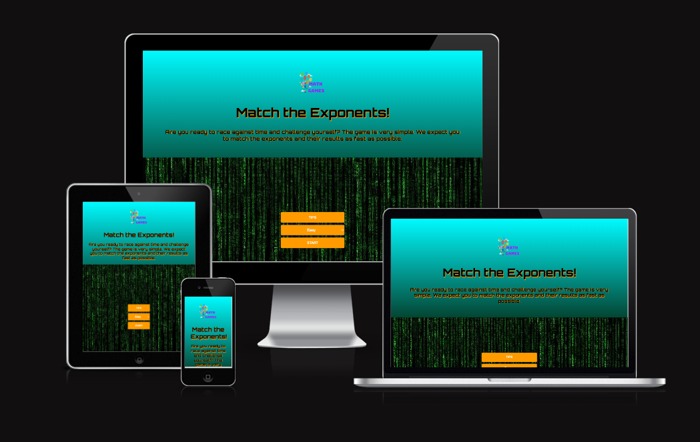

[View the live site here](https://techistem.github.io/memory-game/)

## User Experience
### Site Owner's Goals
- To creating an interactive online game to test users' knowledge of 'Exponent'
- To raise awareness about the importance of attention and concentration, that sudden decisions of the user
 while trying to complete the game quickly result in errors and cause a complete loss of time
- To provide a fully responsive game that can be played on a range of devices
### External User's Goals
- To play a fun and interactive online game to test my 'Exponent' knowledge
- To easily navigate the site and to have a way to return to the Home page at any point of the game
- To be able to restart the game at any point while I am playing the game
## Design
### Wireframes
Balsamiq wireframes were created for mobile, tablet and desktop devices to show the structure and overall design of each page of the game.

Home page wireframe

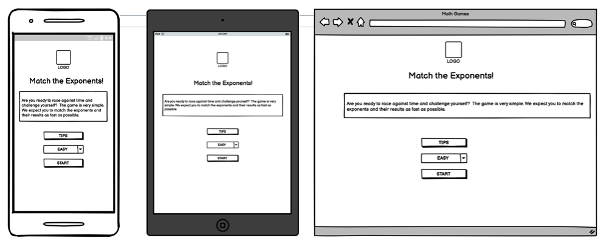

Game page wireframe

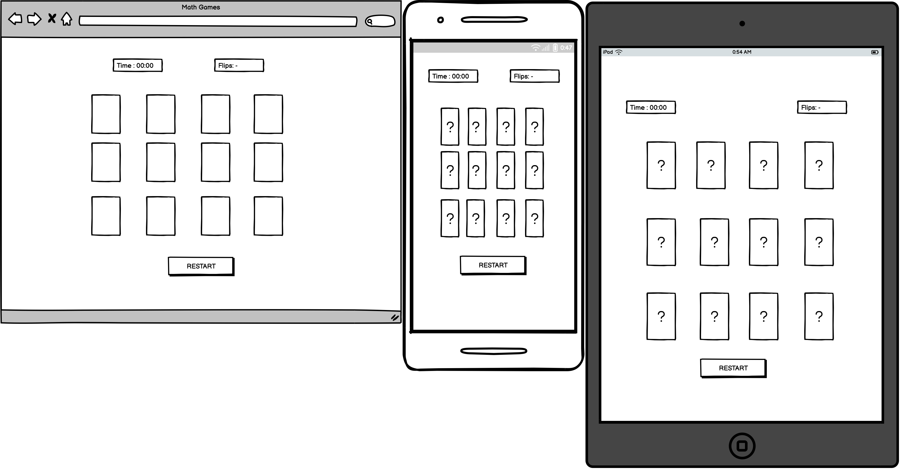

### Colour Scheme
Inspired by the flowing numbers in the movie 'The Matrix', the background color and the appropriate color were chosen. Green color is a color that is eye-catching and eye-catching.
### Typography
'Orbitron' was used as the font style. It is an interesting writing style for the game page. And it does not tire the eyes.
## Features
This game is designed to be both fun and easy to use. In this way, it is a very fun game for classroom activities and for students to review the subject. The features implemented throughout the game support this goal.
### Home page
-  This is what the user will be greeted with upon opening the game, and also what they will return to any time they click a button to return Home.
- It is an easy to navigate Home page, with the title of the game at the top, and 3 buttons below:
    
    - A Play button to start the game
    - A How to play button to take the user to the rules of the game
    - A High Scores button to take the user to the high scores page

Desktop home page

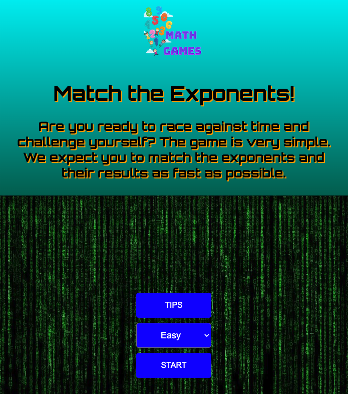

Mobile home page

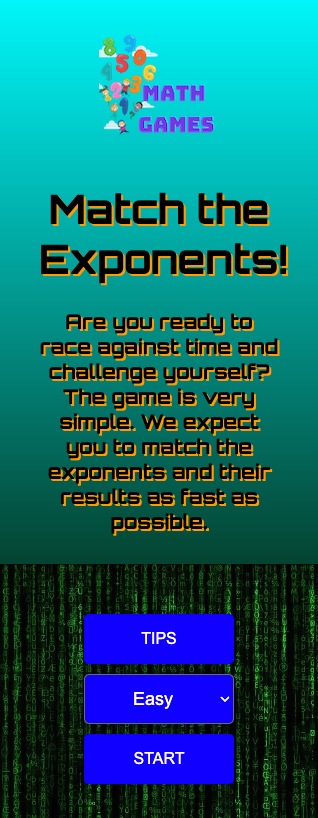

### Tips
- Tips section gives the user brief information about how to play the game with an example.
- There is also a Restart button at the bottom to allow the user to return to the Home page.

Desktop tips section

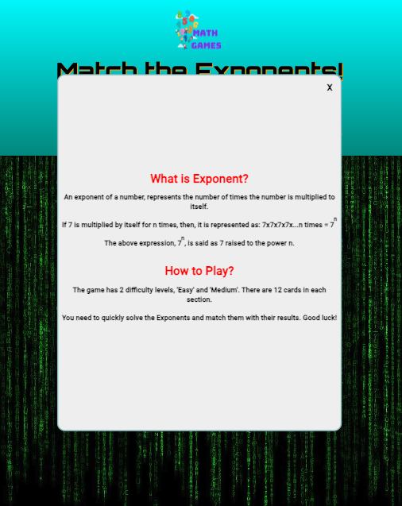

Mobile tips section

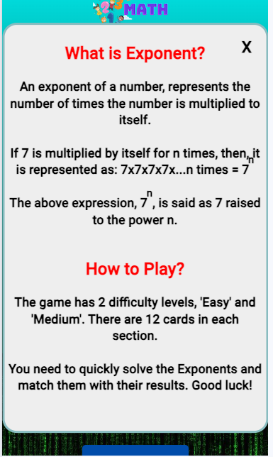

### Game section
- When the user selects either 'Easy' or 'Medium', 12 cards will appear 
on the screen. When he clicks on one of these cards, he will try to 
find the card corresponding to the value of the number he encounters.
- Starting from 12 cards, matching cards 2 at a time will work. 
If you want to exit the game or move to the next level, there is a 
'Restart' button at the bottom.

Desktop game section

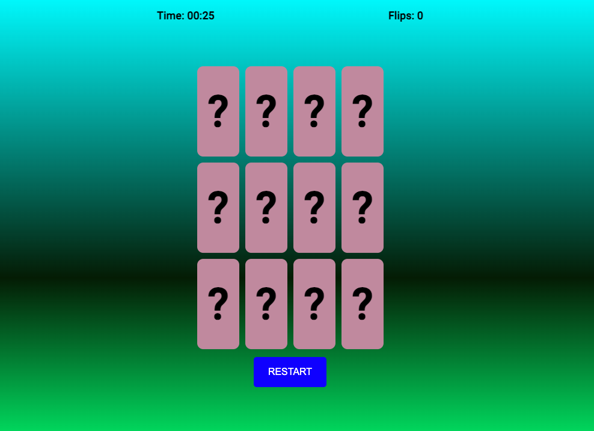

Mobile game section

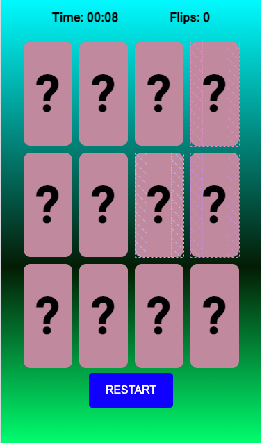

- If the user cannot find the 2nd card with the correct value, the cards will be returned.

#### Details
- There is a 'Details' section at the top of the game cards. This section contains timer and flips.

 Details 

### End Game
- After the user matches all the cards, the text 'You find all matches' will automatically appear on the screen.

End Game Message

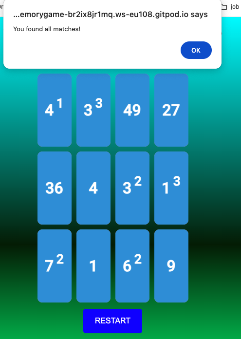

### Future Features
- I would also like to add the hard level to the game to allow the user to choose between easy, medium and hard questions. Because I believe that the difficulty level will give the user a different experience. He/she will be able to fill in the knowledge gap with more difficult questions.

- I would like to add more questions to avoid repeating the questions of each section. The user will thus be excited as if completing the puzzle.

- Sound effects or end-of-level celebration animations will make the game more attractive for the user. For example, there may be a sound effect when the user clicks on the wrong card.

- A more comprehensive game in which students can compete as a team in the classroom will enable students to participate more actively in lessons and work as a team.And a leaderboard can be made to list the teams.

- I would like to set a timer that counts down. In this way, they learn attention, concentration and coping with stress.

## Technologies
- HTML
    - Used to create the structure of the game
- CSS
    - Used to implement styling across the game
- JavaScript
    - Used to create interactivity throughout the game
- Gitpod
    - Used to develop and edit the code
- Git
    - Used to add, commit and push the code
- GitHub
  - Used to store and deploy the 
- [Balsamiq](https://balsamiq.com/)
    - Used to create wireframes
- [Google Fonts](https://fonts.google.com/)
    - Used to import fonts
- [Favicon](https://favicon.io/)
    - Used to create a favicon  
## Testing
### Responsiveness
- The website has been tested on Chrome, Edge and Firefox as well as on an iPhone 15/14, iPhone 13 mini, Samsung Galaxy S22, and iPad 6th Generation in order to check the responsiveness on different devices and different browsers.
- Each section of the quiz was also tested on the [Responsive Design Checker website](https://responsivedesignchecker.com/), and on Chrome and Firefox developer tools, to ensure that the quiz is responsive on a range of mobile, tablet and desktop devices.
### Accessibility
- [Wave accessibility tool](https://wave.webaim.org/) was used to check how accessible the quiz is. No errors were found, and the only alert mentioned that there were no page regions found on the site. Given that this website is a quiz game, it was not necessary to have regions like a header, nav bar or footer, as the entire body of the quiz is contained within the purple section in the centre of the page.

Wave results

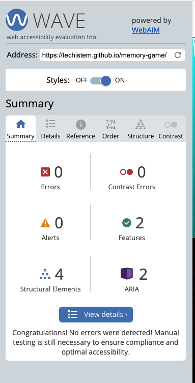

### Validator Testing

