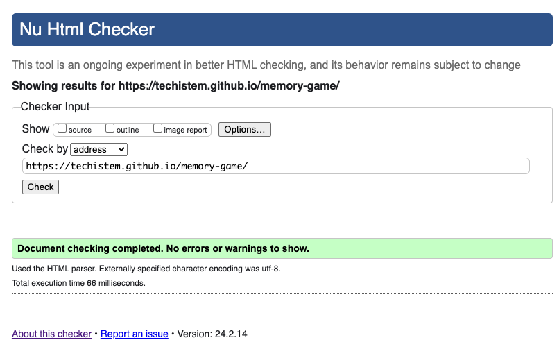
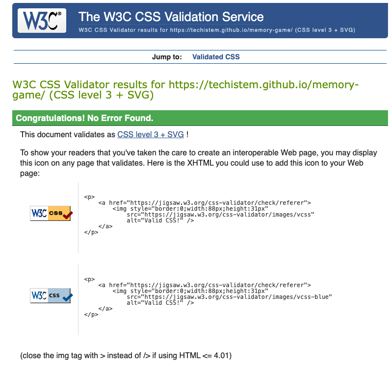
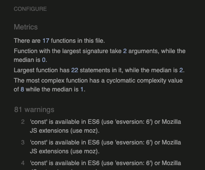
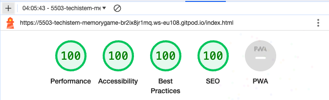
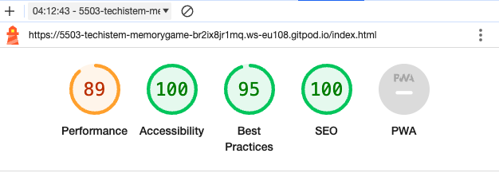

# Math Games
'Maths Game' is a memory game designed to help people challenge themselves with 'Exponents'. 
This game has two levels: 'Easy' and 'Medium'. Each section has 12 4x3 cards and a timer to see how long and how many 
moves it takes to match the cards.

[View the live site here](https://techistem.github.io/memory-game/)

## User Experience
### Site Owner's Goals
- To create an interactive online game to test users' knowledge of 'Exponents'.
- To highlight the importance of attention and concentration. Sudden decisions to try to complete the game quickly 
result in errors that lose time.
- To provide a fully responsive game that can be played on a range of devices.
### External User's Goals
- To play a fun and interactive online game to test my 'Exponent' knowledge
- To easily navigate the site and to have a way to return to the Home page at any point of the game
- To be able to restart the game at any point while I am playing the game
## Design
### Wireframes
Balsamiq wireframes were created for mobile, tablet and desktop devices to show the structure 
and overall design of each page of the game.

Home page wireframe

Game page wireframe

### Colour Scheme
Inspired by the flowing numbers in the movie 'The Matrix', the background color and the appropriate color were chosen. 
Green is a color that is eye-catching and engaging.
### Typography
'Orbitron' was used as the font style. It is an interesting writing style for the game page and it does not tire the eyes.
## Features
Designed to be both fun and easy to use, this game is appropriate for classroom activities and for students 
to practice and learn individually. The features implemented throughout the game support this goal.
### Home page
-  This is what the user will be greeted with upon opening the game, and also what they will return to any time they click the button to return Home.
- IThe Home page is easy to navigate, with the title of the game at the top and three buttons below:
    
    - A Play button to start the game.
    - A How to Play button to take the user to the rules of the game.
    - A High Scores button to take the user to the high scores page.

Desktop home page

Mobile home page

### Tips
- A Tips section gives the userinformation about how to play the game with an example.
- There is also a Restart button at the bottom to allow the user to return to the Home page.

Desktop tips section

Mobile tips section

### Game section
- When the user selects either 'Easy' or 'Medium', 12 cards will appear 
on the screen. When they click on one a card, they will then try to 
find the card corresponding to the value of the number shown.
- Starting with 12 cards, users will try to match two cards at a time. 
If they want to exit the game or move to the next level, there is a 
'Restart' button at the bottom.

Desktop game section

Mobile game section

- If the user cannot find the 2nd card with the correct value, the cards will be returned.

#### Details
- There is a 'Details' section at the top of the game cards. This section contains the timer, for example.

 Details 

### End Game
- After the user matches all the cards, the text 'You find all matches' will automatically appear on the screen.

End Game Message

### Future Features
- I would like to add a 'hard' level to the game to allow the user to choose between easy, medium and hard questions.
I believe that this extra difficulty level will give the user a different experience by being able to challenge themselves further as they build confidence.

- I would like to add more questions to each section and avoid repetition.

- Sound effects or animations will make the game more engaging for the user. For example, a sound effect when the user clicks on the right or wrong card
and an animation to celebrate reaching the end of a level.

- An advanced version of the game in which students can compete as a team may enable students to participate more actively in lessons and work together.
 A leaderboard could encourage friendly competition and celebrate team wins.

- I would like to set a timer that counts down such that users learn the additional skills of concentration and adapting to time-pressure.

## Technologies
- HTML: Used to create the structure of the game.
- CSS: Used to implement styling across the game.
- JavaScript: Used to create interactivity throughout the game.
- Gitpod: Used to develop and edit the code.
- Git: Used to add, commit and push the code.
- GitHub: Used to store and deploy the code.
- [Balsamiq](https://balsamiq.com/)
    - Used to create wireframes
- [Google Fonts](https://fonts.google.com/)
    - Used to import fonts
- [Favicon](https://favicon.io/)
    - Used to create a favicon  
## Testing
### Responsiveness
- The website has been tested on Chrome, Edge and Firefox as well as on an iPhone 15/14, iPhone 13 mini, Samsung Galaxy S22, and iPad 6th Generation in order to check the responsiveness on different devices and different browsers.
- Each section of the quiz was also tested on the [Responsive Design Checker website](https://responsivedesignchecker.com/), and on Chrome and Firefox developer tools, to ensure that the quiz is responsive on a range of mobile, tablet and desktop devices.
### Accessibility
- [Wave accessibility tool](https://wave.webaim.org/) was used to check how accessible the quiz is. No errors were found, and the only alert mentioned that there were no page regions found on the site. Given that this website is a quiz game, it was not necessary to have regions like a header, nav bar or footer, as the entire body of the quiz is contained within the purple section in the centre of the page.

Wave results

### Validator Testing
- HTML
    - No errors were found when the index.html page was passed through the [W3C HTML validator](https://validator.w3.org/).
    
- CSS
    - No errors were found when the quiz was passed through the [W3C CSS validator](https://jigsaw.w3.org/css-validator/).
    
- JavaScript
    
    - No errors were found when either of the JavaScript pages were passed through the [JSHint validator](https://jshint.com/).

    - script.js validator:
        
        

### Lighthouse Testing
- Lighthouse testing was carried out to test the performance, accessibility, best practices and SEO of the quiz on both a desktop and mobile device.

Desktop lighthouse scores

Mobile lighthouse scores

### Testing User Stories
- Expectation: Learning a mathematics subject in a fun and interactive way.
    - Result: With two levels of difficulty, the site is an interesting way to test users' knowledge. 
- Expectation: The user must complete the game in the shortest time possible and with the fewest moves.
    - Result: Users' ability to concentrate, the time to complete the task and the number of times the cards are 
    clicked varies according to their level of knowledge.
- Expectation: Having clear instructions on how to play the game.
    - Result: The Tips section explains how to play the game, with an example.
- Expectation: To easily navigate the site and have a way to return to the Home page at any point of the game.
    - Result: There is a 'Restart' button at the bottom of the cards to return to the home page.
### Solved Bugs
- The cards were not shuffled. I fixed this by adding an event listener that triggered the shuffling function when the start 
button was clicked.
- When Exponents were placed in the 'div' element in HTML, they could not be activated with JS:
The `cardFrontTemplate` variable is creates an array containing the HTML structure of each card.
- 72 The numbers created in the form  covered the surface of the cards.
- Transform property was used in CSS. CSS style adjustments were made according to different screens.

### Deployment

The site was deployed to GitHub Pages. The steps to deploy are as follows:

- In the [GitHub repository](https://github.com/techistem/memory-game), navigate to the Settings tab 
- From the source section drop-down menu, select the **Main** Branch, then click "Save".
- The page will be automatically refreshed with a detailed ribbon display to indicate the successful deployment.

The live link can be found [here](https://techistem.github.io/memory-game)

### Local Deployment

This project can be cloned or forked in order to make a local copy on your own system.

#### Cloning

You can clone the repository by following these steps:

1. Go to the [GitHub repository](https://github.com/techistem/memory-game) 
2. Locate the Code button above the list of files and click it 
3. Select if you prefer to clone using HTTPS, SSH, or GitHub CLI and click the copy button to copy the URL to your clipboard
4. Open Git Bash or Terminal
5. Change the current working directory to the one where you want the cloned directory
6. In your IDE Terminal, type the following command to clone my repository:
	- `git clone https://github.com/techistem/memory-game.git`
7. Press Enter to create your local clone.

Alternatively, if using Gitpod, you can click below to create your own workspace using this repository.

Please note that in order to directly open the project in Gitpod, you need to have the browser extension installed.
A tutorial on how to do that can be found [here](https://www.gitpod.io/docs/configure/user-settings/browser-extension).

#### Forking

By forking the GitHub Repository, we make a copy of the original repository on our GitHub account to view and/or make changes without affecting the original owner's repository.
You can fork this repository by using the following steps:

1. Log in to GitHub and locate the [GitHub Repository](https://github.com/techistem/memory-game)
2. At the top of the Repository (not top of page) just above the "Settings" Button on the menu, locate the "Fork" Button.
3. Once clicked, you should now have a copy of the original repository in your own GitHub account!

### Local VS Deployment

There are no major differences between the local version in Gitpod, versus the live version on GitHub Pages.

## Credits
### Content
- The questions and solutions of the game were written by myself.
- The fonts were chosen with [Google Font](https://fonts.google.com/).
- The logo was designed by myself using [Canva](https://www.canva.com/).
- The favicon is from [Favicon](https://favicon.io/).
### Media
- The background image is from [Pixabay](Image by <a href="https://pixabay.com/users/51581-51581/?utm_source=link-attribution&utm_medium=referral&utm_campaign=image&utm_content=356024">51581</a> from <a href="https://pixabay.com//?utm_source=link-attribution&utm_medium=referral&utm_campaign=image&utm_content=356024">Pixabay</a>).
### Code
- The cards were not working properly. Each clicked card did not close and remained open on the screen. So function checkCards(cardFront, cardBack){ . I received tutor and installer support while doing the part. You helped me edit this part.

